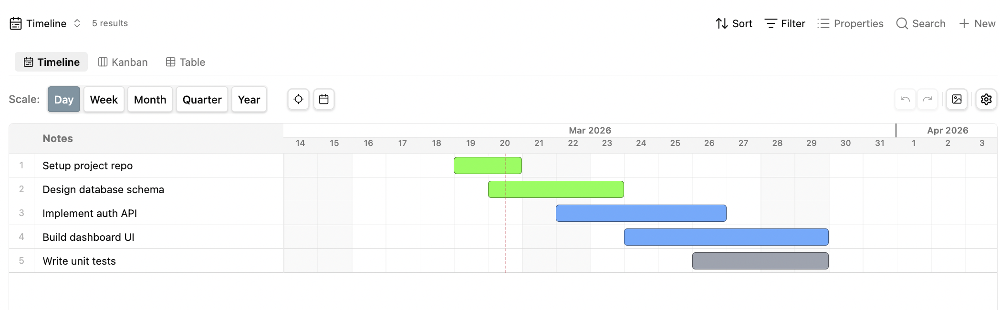
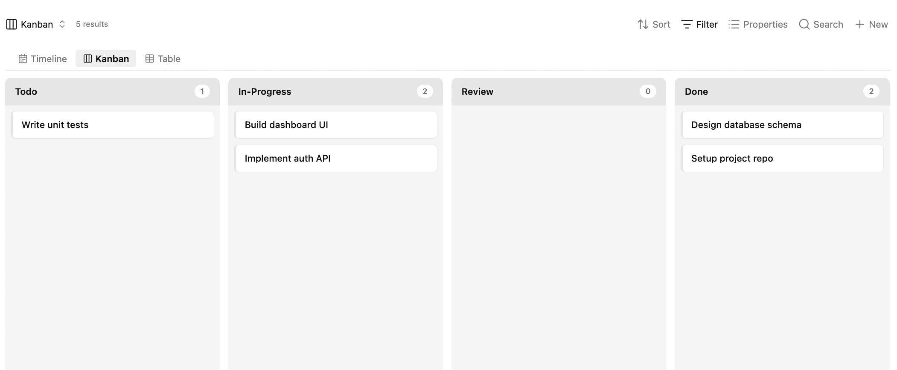
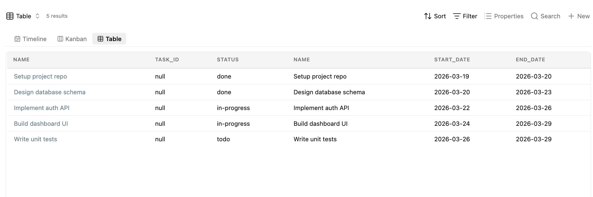

# Gantt Master

> Your Obsidian notes have deadlines. Now they have a timeline too.

**Gantt Master** turns [Obsidian Bases](https://obsidian.md/bases) into a project management powerhouse — three views, one source of truth, zero context switching.

---

## Three views. One vault. No nonsense.

### Timeline — Because spreadsheets are not Gantt charts

A proper Gantt-style timeline that actually lets you *do things*:

- Drag bars to reschedule. Resize edges to adjust dates. Done.
- Draw new tasks by clicking and dragging on empty space
- Shift+click to multi-select, then move everything at once
- 5 zoom levels (Day → Year), today marker, jump-to-date
- Vivid color coding, row numbers, inline editing
- Export to PNG when your PM asks for "a visual"

### Kanban — Drag. Drop. Ship.

Cards grouped by any frontmatter property. Drag between columns to update status — frontmatter writes itself.

Default columns: `todo` → `in-progress` → `review` → `done`. Or use whatever values you want.

### Table — The spreadsheet that respects your notes

Sortable columns, color-coded rows, click-to-open. Pick up to 8 columns to display, or show everything.

---

## Quick start

1. Create a `.base` file pointing at a folder of notes
2. Notes need frontmatter with date properties (e.g. `start-date`, `end-date`)
3. Add a Timeline/Kanban/Table view from the Bases view selector
4. Start dragging things around

Or just hit **Create Sample Base** in plugin settings and play with the demo.

---

## Install

**Via BRAT** (recommended for now):

1. Install and enable **BRAT** in Obsidian
2. Add beta plugin: `https://github.com/vudonganh/gantt-master`
3. Enable **Gantt Master** in Community plugins

---

## Settings

- **Week starts on** — Monday or Sunday
- **Create Sample Base** — generates a ready-to-use demo project

---

## License

MIT — do whatever you want with it.
